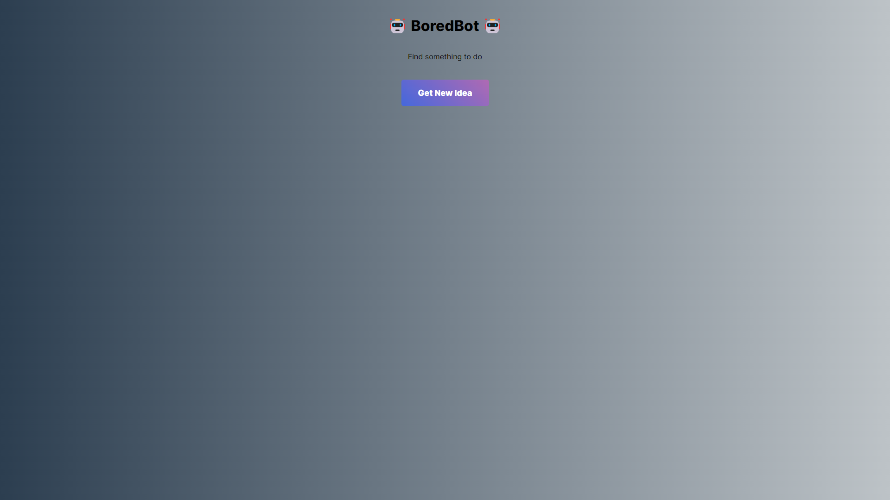
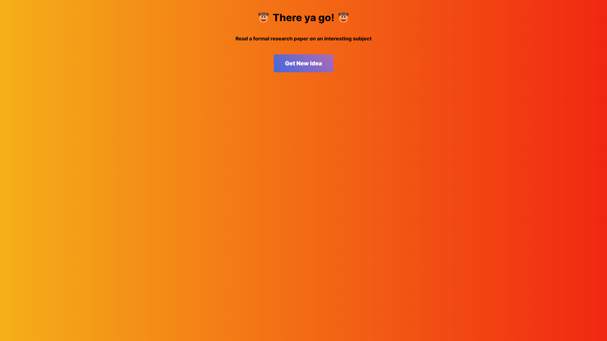

# Bored Bot

A web application to give you ideas of what to do when you are bored.

## Overview

### Screenshots

### Links

-   Live Site URL: [GitHub Pages](https://dpass47.github.io/bored-bot/)
-   [The Bored API](https://www.boredapi.com/)

## My process

I started by building the initial layout with HTML and styled it using CSS. As it is a simple webpage, there was not much methodology to the layout of the application as there are only a few components to make it functional. I used the Fetch API to grab the data inside JavaScript so it could be properly displayed on the webpage after the button is clicked. I used classList.add in JavaScript to also change some styling for elements when the button is clicked, namely the background and text color for better readability.

### Built with

-   HTML
-   CSS
-   JavaScript
-   The Bored API
-   Mobile-first workflow

### What I learned

I practiced with using the Fetch API within JavaScript to get data from the API to display on the page. I learned that there are a lot of APIs available to make some pretty cool web applications with. I stumbled upon The Bored API, and thought it would be fun to create a simple web page suggesting fun activities to do.

## Author

-   Website - [Dante Passalacqua](https://www.devdante.com)
-   Twitter - [@dpass47](https://www.twitter.com/dpass47)
